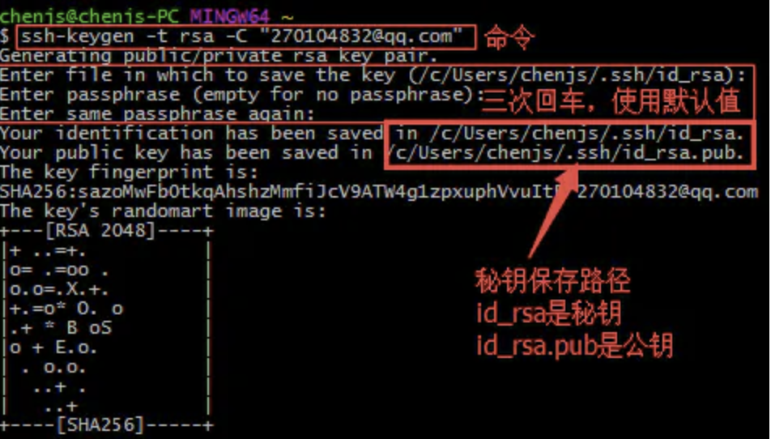
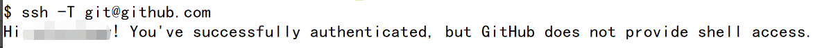

### 配置 Github SSH key
#### 生成 SSH key
- 打开命令工具  
Windows打开 git bash  
MacOS打开terminal/iterm
- 运行命令 `ssh-keygen -t rsa -C "your_email@example.com"`  

#### 设置 Github key
- 打开公钥文件手动复制或者用命令
- windows `cat ~/.ssh/id_rsa.pub|clip`
- MacOS `cat ~/.ssh/id_rsa.pub|pbcopy`
- 打开并登录Github, 【settings】->【SSH and GPG keys】->【New SSH key】  
- 输入title【任意】并把复制的公钥粘贴道到key
- 最后点击【Add SSH key】完成添加
#### 验证配置
- 运行命令: `ssh -T git@github.com`  
如果看到如下信息表示成功:  

 

